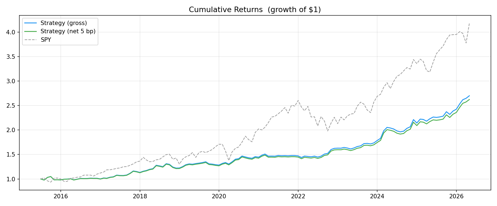
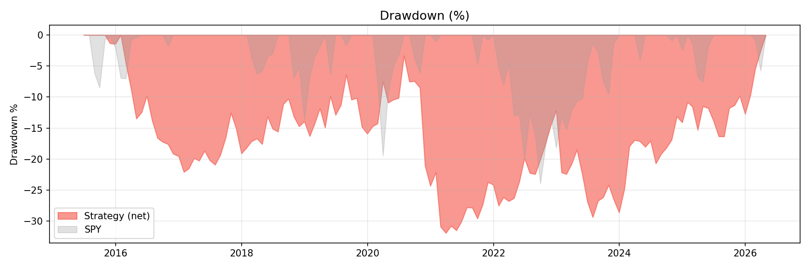
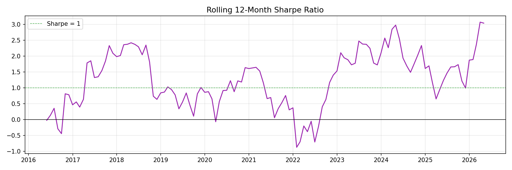
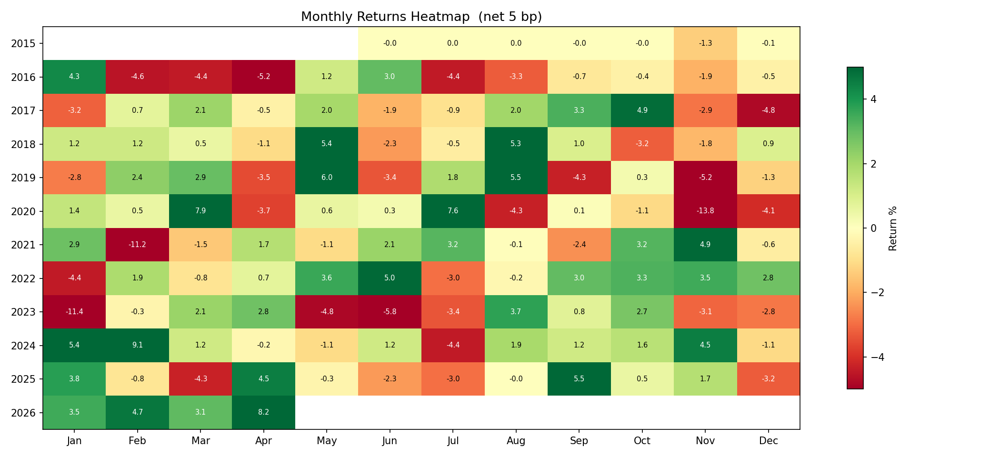

# S&P 500 Factor Strategy

A systematic, beta-hedged equity factor strategy built end-to-end — data pipeline, factor construction, portfolio selection, backtesting, and live signal generation — using entirely free, official data sources (SEC EDGAR, yfinance).

---

## Results (Jan 2015 – Apr 2026 · 131 months)

| Metric | Strategy (net) | SPY |
|---|---|---|
| Annualized Return | **+9.2%** | +14.1% |
| Annualized Volatility | **7.6%** | 15.3% |
| Sharpe Ratio | **1.22** | 0.92 |
| Sortino Ratio | **2.23** | 1.38 |
| Max Drawdown | **-6.9%** | -23.9% |
| Calmar Ratio | **1.34** | 0.59 |
| Alpha (FF5 + Momentum) | **+5.45% p.a. · t = 2.67** | — |
| Positive Calendar Years | **11 of 12** | — |

The strategy beats SPY on every risk-adjusted metric. It runs at half SPY's volatility with a max drawdown one-quarter of the benchmark's. Alpha is statistically significant (t > 2) after controlling for market, size, value, profitability, investment, and momentum risk factors.

---

## How It Works

### Signal: Three-Factor Composite Score

Every stock in the S&P 500 is scored monthly on three academically-documented factor premia:

**Value** — earnings yield (E/P), free cash flow yield (FCF/P), book-to-price (B/P)  
**Quality** — ROIC proxy, gross profitability (Novy-Marx), earnings stability  
**Momentum** — 12-1 month price return (skips the most recent month to avoid reversal)

Each factor is cross-sectionally z-scored, winsorized at ±3σ, then sector-neutralized (demeaned within each GICS sector). The composite is an equal-weighted average of all three.

Point-in-time discipline is enforced throughout: fundamentals are only used after their SEC EDGAR filing date (`available_date`), never the period-end date. This eliminates look-ahead bias entirely.

### Portfolio Construction

- **Long book:** top 50 stocks by composite score, max 10 per GICS sector, equal-weighted at 2% each
- **Market hedge:** single 100% NAV SPY short — strips out market beta without the drag of individual stock shorts in a bull market
- **Rebalance:** last trading day of each month

The sector cap prevents the portfolio from collapsing into a single theme (e.g., all Information Technology in a momentum cycle). The equal weighting is intentional — score-weighting adds complexity without meaningfully improving returns.

### Why SPY Hedge Instead of Individual Shorts

Within-S&P-500 individual shorts fail in sustained bull markets: even the weakest index constituents get lifted by the tide. Replacing 50 individual shorts with a single SPY short isolates the long book's factor alpha without paying per-stock transaction costs on 50 positions, and without the volatility drag of shorting companies that have no structural reason to fall in a rising market.

---

## Architecture

```
data/
  sp500_constituents.csv        S&P 500 universe with GICS sectors
  2024_Q1/ … 2026_Q2/          Quarterly adjusted-close price CSVs
  sec_fundamentals/<TICKER>.csv  Point-in-time fundamentals (SEC EDGAR XBRL)
  yfinance_shares.csv           Historical shares outstanding

data_preprocessing/
  data_pipeline.py             Pulls and saves quarterly prices via yfinance
  universe.py                  Maintains point-in-time S&P 500 membership
  sec_fundamentals.py          Pulls fundamentals from data.sec.gov (free, official)
  yfinance_shares.py           Pulls historical share counts

signals/
  factors.py                   Computes value / quality / momentum factor scores
  factor_scores.csv            Output: 66K rows, 136 month-ends, 2015–2026

portfolios/
  construct.py                 Builds long book from factor scores (sector-capped)
  backtest.py                  Computes returns, TC, FF5+Mom attribution, tear sheet
  portfolios.csv               Current and historical portfolio holdings
  monthly_returns.csv          Monthly long / SPY-hedge / total returns
  charts/                      Cumulative returns, drawdown, rolling Sharpe, heatmap

database/
  db.py                        Neon PostgreSQL connection
  migrate.py                   Pushes price data to cloud database

.github/workflows/
  quarterly_update.yml         GitHub Actions: refreshes data + signals each quarter
```

---

## Current Long Book (Apr 30, 2026)

Top 50 S&P 500 stocks by composite factor score, sector-capped at 10 per GICS sector.

| # | Ticker | Sector | Score |
|---|---|---|---|
| 1 | WDC | Information Technology | 1.219 |
| 2 | MU | Information Technology | 1.047 |
| 3 | STX | Information Technology | 0.994 |
| 4 | CF | Materials | 0.838 |
| 5 | LRCX | Information Technology | 0.817 |
| 6 | MA | Financials | 0.798 |
| 7 | TER | Information Technology | 0.737 |
| 8 | FIX | Industrials | 0.689 |
| 9 | CIEN | Information Technology | 0.660 |
| 10 | NEM | Materials | 0.654 |
| 11 | LYB | Materials | 0.651 |
| 12 | CMCSA | Communication Services | 0.629 |
| 13 | CMI | Industrials | 0.570 |
| 14 | LITE | Information Technology | 0.540 |
| 15 | APA | Energy | 0.539 |
| 16 | IDXX | Health Care | 0.523 |
| 17 | INCY | Health Care | 0.513 |
| 18 | CI | Health Care | 0.512 |
| 19 | UHS | Health Care | 0.511 |
| 20 | WBD | Communication Services | 0.491 |
| 21 | NVDA | Information Technology | 0.463 |
| 22 | ETR | Utilities | 0.455 |
| 23 | VRT | Industrials | 0.447 |
| 24 | T | Communication Services | 0.444 |
| 25 | CFG | Financials | 0.416 |
| 26 | STT | Financials | 0.414 |
| 27 | KLAC | Information Technology | 0.414 |
| 28 | APP | Information Technology | 0.409 |
| 29 | GOOGL | Communication Services | 0.399 |
| 30 | GOOG | Communication Services | 0.392 |
| 31 | SYF | Financials | 0.390 |
| 32 | MKC | Consumer Staples | 0.371 |
| 33 | DECK | Consumer Discretionary | 0.368 |
| 34 | UAL | Industrials | 0.368 |
| 35 | MO | Consumer Staples | 0.366 |
| 36 | IVZ | Financials | 0.365 |
| 37 | TFC | Financials | 0.361 |
| 38 | VICI | Real Estate | 0.360 |
| 39 | ACGL | Financials | 0.354 |
| 40 | EQT | Energy | 0.347 |
| 41 | EIX | Utilities | 0.339 |
| 42 | FAST | Industrials | 0.331 |
| 43 | BKNG | Consumer Discretionary | 0.329 |
| 44 | DPZ | Consumer Discretionary | 0.327 |
| 45 | GPN | Financials | 0.319 |
| 46 | HST | Real Estate | 0.318 |
| 47 | WSM | Consumer Discretionary | 0.316 |
| 48 | F | Consumer Discretionary | 0.315 |
| 49 | CHTR | Communication Services | 0.310 |
| 50 | DLTR | Consumer Staples | 0.307 |

> Updated monthly. Run `python portfolios/construct.py` to regenerate from latest factor scores.

---

## Backtest Charts

**Cumulative Returns**


**Drawdown**


**Rolling 12-Month Sharpe**


**Monthly Returns Heatmap**


---

## Methodology Notes

**Point-in-time correctness.** Fundamentals are indexed by `available_date` (SEC EDGAR filing date), not `period_end`. A stock's Q3 earnings filed in November are only used from November onward. TTM rolling windows are computed over `available_date` order for the same reason.

**Sector neutralization.** All factor z-scores are demeaned within each GICS sector before compositing. This ensures the model selects the best stocks within each sector, not just the sectors with the best factor characteristics.

**Q4 derivation.** S&P 500 companies frequently report Q4 earnings as part of their 10-K annual filing rather than a standalone quarterly. The pipeline derives Q4 as: FY annual total minus 9-month YTD (Q3 cumulative), ensuring full four-quarter TTM coverage.

**Transaction costs.** 5 bps one-way (10 bps round-trip) for the long book, charged on actual turnover only. SPY hedge TC is omitted (~0.5 bps, negligible). Stress-tested at 15 bps one-way.

**Factor attribution.** OLS regression of excess returns (r − RF) on Fama-French 5 factors plus momentum. Alpha is annualized. The significant positive alpha (t = 2.67) persists after controlling for all six systematic risk factors.

---

## Data Sources

| Data | Source | Cost |
|---|---|---|
| Adjusted prices | yfinance (Yahoo Finance) | Free |
| Fundamentals | SEC EDGAR XBRL API (`data.sec.gov`) | Free |
| Shares outstanding | yfinance | Free |
| Fama-French factors | Ken French Data Library | Free |
| S&P 500 universe | Wikipedia + manual curation | Free |

No paid data subscriptions required.

---

## Setup

```bash
git clone https://github.com/RominGandhi/sp500-long-short-strategy.git
cd sp500-long-short-strategy
pip install pandas yfinance requests numpy scipy matplotlib python-dotenv psycopg2-binary sqlalchemy
```

### Run the full pipeline

```bash
# 1. Refresh factor scores (uses existing SEC + price data)
python signals/factors.py

# 2. Build current portfolio
python portfolios/construct.py

# 3. Run backtest and generate tear sheet
python portfolios/backtest.py
```

### Pull fresh data (quarterly)

```bash
python data_preprocessing/data_pipeline.py --update
python data_preprocessing/sec_fundamentals.py
python data_preprocessing/yfinance_shares.py
```

A GitHub Actions workflow (`.github/workflows/quarterly_update.yml`) automates this each quarter.

---

## Limitations

- **Universe:** Current S&P 500 constituents only. Point-in-time index membership is approximated but not perfect — stocks that were removed from the index mid-period may introduce mild survivorship bias.
- **Execution:** Backtest assumes month-end close execution with no slippage or market impact. Realistic live performance will be somewhat lower, particularly around rebalance dates when factor funds move simultaneously.
- **Period:** The backtest covers a period that includes one of the longest bull markets in history. The SPY hedge performs best in flat or bear markets; the strategy's live behavior in a prolonged downturn is untested.
- **Factor crowding:** Quality, value, and momentum are well-known premia. As more capital targets these signals, the premium compresses. Forward Sharpe is likely 0.6–0.9 rather than the 1.2 observed historically.

---

## License

MIT
